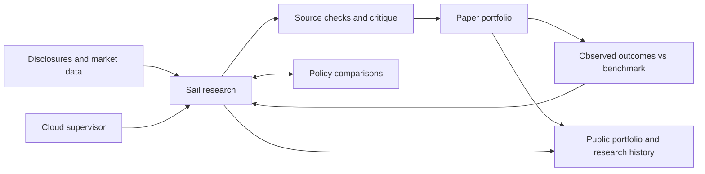

# Architecture

One persistent paper account, a continuous research history, and bounded research sessions. A small independent Cloudflare supervisor controls availability and funding; Sail performs the research. Website visitors only read saved results.

## Research and improvement

`portfolio_runtime/service.py` preserves the paper account while creating immutable research epochs. Each epoch records its source cutoff, model profiles, policy version, deadline and credit reservation. Daily source captures retain original observations; previously published findings are never rewritten to match a later conclusion.

The universe is S&P 500 stocks plus cash. Membership currently comes from a community-maintained list; financial facts come from SEC Companyfacts and selected primary filings. Source periods, units, tags, accessions and hashes are retained. Missing sector-specific or valuation evidence remains missing. Delayed Yahoo observations support research and the daily-bar paper adapter; they are not brokerage quotes.

Memory carries prior theses and unanswered questions across epochs. A dated outcome journal returns the actual portfolio record to later allocation reviews. This closes the investment feedback loop; it does not establish that a particular process change caused better returns.

The supporting `PolicyLab` (`portfolio_runtime/improvement.py`) compares fixed research-memory policies on matched dated tasks, with separate audit companies. Promotion and rollback affect subsequent epochs only. Numerical source checks do not establish investment quality. Autonomous investment-policy selection requires a prospective comparison that is still to be built. [Evaluation protocol](EVALUATION.md).

## Paper accounting

A single writer reconciles the account before considering a replacement allocation. Proposals remain distinct from fills. The mandate is long-only, no leverage, whole shares, at most 20% per stock, with $100,000 of virtual initial capital.

Daily-bar paper fills use an eligible later market opening with modeled slippage. Returns require sourced portfolio and S&P 500 Total Return observations at matching times. External deposits are excluded from time-weighted returns. Inference and infrastructure expenses are reported separately from trading returns.

Daily constituent refresh and market accounting continue independently of research funding. Unsupported corporate actions explicitly suspend affected accounting; this version does not infer dividend entitlement or payment dates. No live Schwab execution service exists.

## Cloud operation

The frozen Sailbox bundle contains application code and public evidence. Credentials are injected by the provider only on allowed HTTPS routes; brokerage credentials are excluded. The service and its bootstrap hold process locks to prevent duplicate writers.

The Cloudflare supervisor (`control-plane/supervisor.mjs`) runs independently of the Mac and the Sail agent. It controls admission, checks credit and progress, restarts the same machine's process, and sends exception or completion emails. Research uses available Sail credit without preset session or weekly dollar caps. Outstanding requests and remaining host costs stay reserved; top-ups fund subsequent sessions automatically. Evidence and novelty checks govern repeated work.

The service uses one durable Voyage event sequence across all epochs; an hourly research completion does not terminate the week's trace. Public activity and private health distinguish deliberate waiting from a stalled process.

Private R2 snapshots preserve paper, request, research, policy and trace records. Each SQLite file is backed up consistently and hash-checked; the set is not a simultaneous transaction across databases. Automatic recovery uses the existing Sail disk. Restoring an older backup onto another machine requires provider-request reconciliation before spending or execution resumes.

## Publication

The main page reads a small checkpoint. A separate paginated research history contains explicit conclusions, source claims, uncertainties and portfolio consequences. Internal reasoning blocks, prompts, credentials and account identifiers are excluded. Server validation and immutable record IDs make retries safe; later revisions receive new entries.

[Operations](OPERATIONS.md) · [Roadmap](ROADMAP.md)
