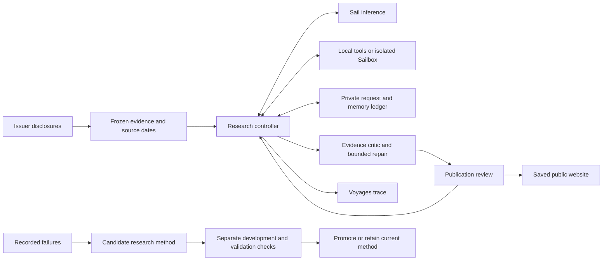

# Architecture

The project follows public companies across the AI stack: what the evidence says,
what remains uncertain, and what would change the view. Microsoft is the first
reviewed case. All nine now have source-checked cash bridges and completed experimental research workflows. They are not holdings or fully reviewed investment cases.

## Evidence and research

Checked facts preserve units, periods, arithmetic, and source IDs. Registered
source captures preserve publication/retrieval dates, hashes, and exact passage
positions. Source text is evidence, never permission to execute instructions.

The investigator chooses bounded source reads and calculations, saves hypotheses
and invalidation conditions, and drafts a report. Its next invocation resumes
saved requests and evidence. Context compaction preserves observed passages,
calculations, and hypotheses while removing repeated transcript text.

The original live tool registry covers two Microsoft documents. The broader
nine-company corpus is a separately frozen research input; listing a company
on the website does not silently add it to the live source monitor.

An independent critic may request one repair. Schema and citation checks cannot
prove arbitrary prose correct, so research publication has a separate review
boundary. New investigations accept a single optional JSON fence under a frozen
format policy; this does not repair content or change historical results.

[Research loop](RESEARCH-LOOP.md) · [Source inbox](SOURCE-WATCH.md) ·
[Checked source handoff](SOURCE-CURATION.md)

## Execution and memory

The MacBook currently owns the authoritative SQLite ledger and credentials.
The [Sailbox worker](CLOUD-WORKER.md) executes allowlisted tools against uploaded
public evidence, without credentials or network access. Receipts survive sleep
and are verified locally. It does not yet host the complete controller.

Reviewed research can inform later investigations. Draft experiments and critic
benchmarks cannot become company facts. The original assignment queue has two
permanent pilot slots; a new experiment never resets their history.

[Queue protocol](RESEARCH-QUEUE.md) · [Sail products](SAIL-PRODUCTS.md)

## Requests, improvement, and costs

Every model request freezes its body, model, completion window, rates, and
allowance before submission. Recovery keeps the original request identity and
retrieves a known response. Missing usage or an uncertain submission is not free.

The [settlement policy](BUDGET.md) replaces a completed request's conservative
hold with a validated usage estimate through an immutable receipt. Historical
requests remain unchanged. Shared-context caching uses a separate explicit
write/read cost contract inside this same ledger.

The improvement gate compares a candidate evidence-critic prompt with the
current prompt on fixed development and separately authored validation cases.
It can promote the prompt only under its frozen no-regression rule. This is
bounded method selection, not permission to edit arbitrary code, alter tests,
change budgets, publish reports, or trade. See [current state](CURRENT-STATE.md)
for what has actually run.

## Public and account boundaries

The website serves allowlisted saved JSON. Visitors cannot launch model requests
or access private prompts, full captures, credentials, or account identifiers.
Technical experiment results live on GitHub; the page highlights companies and
the nine-company cash explorer and one measured research checkpoint. Deployment is separate from research.

The current page has two independent inputs:

- `public/cash-map.json` is a curated financial record. The site validates all current/prior arithmetic, allowed issuer URLs and the exact dataset hash in `data/research/cash-map-review.json` before building.
- `scripts/export_presentation.py` reads one saved campaign through a read-only database snapshot. It exports allowlisted counts, check results and known cost estimates to `public/agent-state.json`. Model prose, request IDs and private trace links are excluded.

The final campaign publisher can refresh the typed checkpoint. It cannot alter the cash map or turn a draft into an approved financial claim. A private publication hold permits an active editor to take over a concurrent deployment without changing the frozen research protocol.

Schwab is disconnected. Future execution will require a separate structured
order service with an owner-defined mandate, deterministic exposure and order
checks, reconciliation, and a stop control. Research prose cannot grant itself
account access. The existing performance calculator uses synthetic fixtures;
there are no live trades or reported investment returns.
