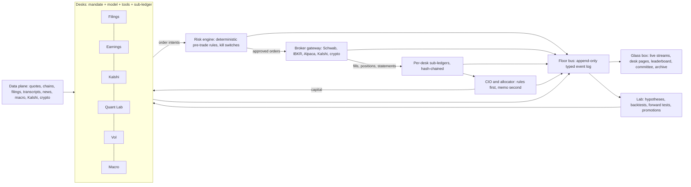

# The Floor: from one paper portfolio to a public swarm of AI portfolio managers

*Proposal written September 14, 2026, during the first unattended paper week (`week-20260914-v6`). Nothing in this document changes the running service. Working name: **The Floor**. Rename freely.*

## Summary

Portfolio Agent has proven the hard, boring part. An unattended cloud service researches 500 companies a day, keeps hash-chained ledgers, reconciles every cent of inference, survives restarts, backs itself up to R2, and publishes an honest public record. What it has not done, and cannot do in its current shape, is make money. The mandate (long-only, S&P 500 only, max 20% per name, daily-bar fills, XBRL facts as the only evidence) produces a closet index fund with a cash drag. The first live allocation is AAPL 14%, MSFT 13%, NVDA 7%, and roughly a fifth of the book in cash.

The proposal: **keep the trust layer, replace the brain, and multiply it.**

Build The Floor: a public trading floor where a roster of AI portfolio-manager *desks*, each with its own mandate, model, venue and personality, research, argue and trade. Every desk starts on paper and must earn real capital through pre-registered gates. A rules-based CIO allocates capital across desks by live track record. A deterministic risk engine sits between every desk and every broker. Every thought, tool call, memo, order, fill and mark is streamed to blakewoods.us in near-real time and archived immutably, so the public watches the fund think.

Venues: Schwab stays as the flagship equities and options account. Alpaca (paper sandbox, zero-commission equities and options, the cheapest full market-data feed), tastytrade (futures and futures options with API credentials that never expire), Kalshi (regulated prediction markets) and a crypto venue extend "trade anything"; Interactive Brokers only if global markets ever matter. Inference: Sail stays as the cheap bulk-screening and sandbox-fleet tier; frontier models run the desks and the committee, with Claude Opus 5 as the default desk brain and Claude Fable 5.1 where judgment matters most (CIO, risk review, post-mortems).

The honest economics: a full floor runs $15-30k a month in inference and data, or $200-350k a year. Trading P&L alone justifies that only with roughly $1.5-3M of capital behind desks with proven edge. So spending scales with evidence, not with enthusiasm. For the first six months, treat The Floor as an R&D program that also produces a public artifact nobody else has: a real-money, multi-agent, glass-box fund with verifiable P&L. The gates in section 7 make sure the money follows results.

## 1. Where the project actually is

**Live state (checkpoint of September 14, 20:00 UTC).** Paper equity $100,055.90 with $20,574.41 cash across 20 positions. Time-weighted return +0.056% against +0.112% for the S&P 500 Total Return, so the first day is 5.6 basis points behind, exactly the cash drag. Research has covered 502 of 503 constituents. The service has spent $99.29 on Sail inference; the rehearsal burned about $62 a day at peak. The week ends Friday, September 18, 9 p.m. Pacific.

**What the agents actually know.** Evidence packets are SEC Companyfacts XBRL rows, a Wikipedia constituent list and delayed Yahoo daily bars. There are no filing narratives, no earnings-call transcripts, no news, no consensus estimates, no options data, no macro data and no web access. The public journal shows the consequence: the Marathon Petroleum review concludes that "valuation is incomputable" because the newest supplied share count is from 2011 and the newest debt figure from 2012. Many entries say "the packet cannot answer the question." The agents are careful, well-cited, and blind.

**What the agents are.** Company research rotates DeepSeek V4 Pro, Kimi K2.6 and GLM 5.3 on Sail's Flex window at medium reasoning effort. DeepSeek V4 Pro ASAP writes allocations; Kimi K3 critiques them. These are good extraction models at a few dollars per million tokens. They are not what you would hire to run money.

**What the mandate allows.** `contracts.Mandate` freezes long-only, no leverage, whole shares, 20% per name, S&P 500 membership, next-open fills with 5 bps slippage. `SYMBOL` is `[A-Z]{1,5}`; the universe object must literally be named "S&P 500"; the market calendar is a hard-coded 2026 set that raises in 2027. The paper ledger has no order state machine, no broker order ID, no margin, no short leg and no instrument other than a common share.

**What the system assumes.** One service lock, one paper-writer lock, one Sailbox with one vCPU and 2 GiB, one Durable Object named `portfolio-v1`, one publish token, one page. `PortfolioLedger._state()` replays and re-hashes the entire event chain on every call, and several such calls happen per 60-second tick. `Service.totals()` opens every epoch database on every reservation. This is fine for one desk and one week; it does not survive ten desks trading intraday.

**What Schwab integration is.** A read-only connector whose request allowlist permits exactly three calls: token refresh and two account reads. Order placement raises before reaching the network. There is no `Broker` protocol to implement; `brokerage.py` is an offline reconciliation fixture. The installed `schwab-py` client does expose order placement, order status, options builders and the account-activity stream, so the raw material exists. Schwab refresh tokens expire seven days after creation with no way to extend them, so any Schwab bot needs a human at a browser once a week; there is no sandbox, futures are data-only and crypto is absent.

**What the evaluation machinery measures.** The PolicyLab compares two memory policies on source-check pass rates with paired sign tests. That measures citation hygiene. It cannot say anything about P&L, and by construction it never will.

**What the site is.** Cloudflare Workers on the Free plan, one SQLite Durable Object per concern, 60-second polling, 15-30 second caches, no WebSockets, and a journal validator that rejects any text containing a URL or an angle bracket. Reasoning is excluded in three separate layers. The design is right for a single cautious paper journal and wrong for a live floor.

**What is genuinely valuable and must be kept.** Hash-chained append-only ledgers with derived idempotency keys. Frozen request identities and settlement receipts that never reprice old work. A supervisor that grants spending authority as a signed file rather than trusting the guest. Verified R2 snapshots with restore drills. Validators that run on both the publisher and the server. Honest public reporting that separates "completed" from "correct". Around 354 tests with injected clocks and transports. The people who try to run agents on real money usually skip all of this and blow up; this project built it first. It is the moat.

The current week's output is also an asset: a dated, source-checked fundamental research bank across 502 companies with open questions per name. The flagship desk inherits it as memory.

## 2. Where LLM agents can plausibly make money

Be clear about the base rate. Language models handed a price chart and a chat box are noise traders. In Alpha Arena's first season (October 2025: six frontier models, $10,000 each, crypto perpetuals, reasoning public), Qwen finished +22%, DeepSeek +5%, and Claude, Grok, Gemini and GPT-5 lost between 31% and 63%; the second season's aggregate lost about a third, and the organizer concluded that handing money directly to a model "doesn't work yet". The one nine-year live-money test, the AI Powered Equity ETF, has returned 128% since 2017 against 241% for the S&P 500. There is a deeper problem: models recall historical prices from their training data, so a backtest inside a model's training window is not evidence of anything. Only forward records count, which is why every gate in section 7 is forward-only. And large-cap US equities are the most efficient market on earth. "Maximal profit" will not come from a smarter prompt over the S&P 500.

It can come from four places where a swarm of agents has a comparative advantage over both humans and classical quant systems.

1. **Reading at scale, fast.** Filings, transcripts, 8-Ks, merger agreements, FDA letters, court dockets, regulatory filings. The market takes hours to days to fully digest nuanced text, longer outside the top 200 names. Post-earnings-announcement drift is one of the oldest documented anomalies. An agent that reads every transcript within minutes of release, compares guidance to the prior quarter and to consensus, and grades the *quality* of a beat has a real informational edge, especially in mid-caps with thin coverage.
2. **Discrete-event forecasting.** Prediction markets on economic prints, central-bank decisions, elections and corporate events reward base-rate discipline and fast synthesis of public information. Kalshi is CFTC-regulated and API-first. Skill is measurable with Brier scores against the market price, which makes it the cleanest place to prove or disprove that the agents know anything. Capacity is small, which is fine for a proving ground.
3. **Industrialized quant research.** Agents can propose, code, backtest and walk-forward-validate thousands of strategy hypotheses. The edge is throughput plus discipline: pre-registration, transaction costs, multiple-testing control, and a fixed human-written grader that agents cannot edit. This is the most scalable desk and the one where Sailbox forks are a perfect fit: spin up a fleet, test a fleet of hypotheses, keep receipts.
4. **Structural carry as ballast.** Variance risk premium (defined-risk option premium away from events), futures basis, funding rates. Positive expectancy with tail risk that a risk engine can bound. This gives the floor a positive drift while the research desks hunt.

Two more effects apply at the floor level. Uncorrelated desks with disciplined capital allocation produce a better risk-adjusted book than any single desk. And a public, hash-chained record of every decision creates the dataset that makes later training (Sail LoRA or Tinker on the floor's own labeled decisions) meaningful instead of aspirational.

The mandate for The Floor is therefore *maximal expected profit through earned allocation*: desks compete, the allocator concentrates capital in demonstrated skill, and nobody is trusted because they sound confident.

## 3. Target architecture

**Desk.** One agent loop with a mandate document, a model assignment, a tool set, a sub-ledger and a public page. Desks are declared in a manifest (name, venue, instruments, limits, model, cadence, cost budget). A desk cannot touch a broker. It can only emit an *order intent*, a memo, a question, or a hypothesis.

**Floor bus.** One append-only Postgres event log with typed events: `desk.thought`, `desk.tool_call`, `desk.tool_result`, `desk.memo`, `desk.intent`, `risk.decision`, `broker.order`, `broker.fill`, `ledger.mark`, `cio.allocation`, `lab.hypothesis`, `lab.result`, `ops.alert`. Hash-chained per stream, exactly as `ledger.py` does today. Everything the public sees is a projection of this log. Nothing is edited; corrections are new events.

**Risk engine.** Deterministic Python, no model in the decision path. Pre-trade: instrument allowlist per desk, position and sector limits, gross and net exposure, liquidity (max percentage of average daily volume, minimum price, no micro-caps), options approval level and Greeks limits, intraday-margin and settlement awareness, wash-sale coordination across desks, publication timing. Circuit breakers: desk daily loss, floor daily loss, stale-data halt, reconciliation-mismatch halt, one kill switch reachable from a phone. Every veto is a public event. An optional Fable 5.1 "risk reviewer" can flag narrative problems; it cannot approve.

**Broker gateway.** A `Broker` protocol (balances, positions, quotes, place, replace, cancel, order status stream, transactions) with adapters. Intents are idempotent, keyed by desk and intent ID, and client order IDs carry the desk ID so fills attribute cleanly to sub-ledgers inside one real account. Daily true-up against broker positions and monthly against statements. A paper adapter for every venue driven by the same real-time quotes, so paper and live desks are compared on identical data.

**Data plane.** Real-time equity and options data, EDGAR full-text and XBRL, transcripts, news, macro calendar and releases, Kalshi order books, crypto books. Exposed to desks as tools with caching and provenance: every document an agent reads is hashed and stored, so a visitor can open exactly what the desk saw. This is where the current project is starved, and where a meaningful share of the budget belongs.

**Inference plane.** Provider-agnostic role-to-model mapping. Cheap Sail models for screening and extraction (DeepSeek V4 Flash at $0.09 and $0.18 per million input and output tokens; DeepSeek V4 Pro on the Flex window at $0.46 and $1.39, at September 2026 list prices). Claude Opus 5 ($5 and $25, one-million-token context) as the default desk brain with adaptive thinking. Claude Fable 5.1 ($10 and $50) for the CIO, risk review and post-mortems. Sonnet 5 and Haiku 4.5 for chunking and workers. Other vendors only for bake-off desks. Prompt caching everywhere: frozen system prompt and tool list first, volatile context last.

**CIO and allocator.** Rules first: capital moves only through the gates in section 7. The CIO agent writes the weekly memo, sets research priorities, and can *propose* changes to desk mandates for human approval. It cannot move capital, edit rules, or override risk.

**Lab.** The PolicyLab generalized. Desks and the Lab post hypotheses; a sandbox fleet (Sailbox forks or Modal) backtests them against a fixed grader, with the model's training cutoff treated as a hard wall so memorized history cannot masquerade as skill; survivors go to pre-registered paper forward tests; promotions and rollbacks are public events with the statistics attached. Weekly post-mortems: each desk reviews its worst decisions and files a memo that its future self will read.

**Glass box.** Per-desk Durable Objects with hibernatable WebSockets fan out live streams; projection tables feed the leaderboard; R2 archives everything. Publication policy: thoughts, tool calls and memos stream live; order intents publish after fill or cancel, never before, so nobody can trade ahead of the floor. Prices shown to the public are the floor's own fills and account-level marks, or delayed data with a visible delay label; the site never republishes real-time quotes, depth or single-name prices from licensed feeds (section 8).

**Operations.** The current supervisor generalizes into a floor supervisor: health, budget and kill switch per desk; email and push alerts; nightly backups and restore drills. The deterministic core (bus, risk, gateway, data ingestors) runs on always-on compute that never sleeps through an open.

## 4. Launch roster

Six desks at launch, growing to twelve. Each row states why the desk might earn and how its skill is measured, because a desk without a measurable skill metric is entertainment.

| Desk | Mandate | Venue | Brain | Why it might earn | Skill metric |
|---|---|---|---|---|---|
| **Filings** (the current agent, promoted) | Long/short fundamental book across S&P 500 and Russell 1000; full 10-K/10-Q text, transcripts, cash-flow bridges; holds weeks to months | Schwab | Opus 5, Sail models for screening | Blake's own edge encoded: cash-flow forensics at scale; inherits the 502-company research bank | Excess return vs S&P 500 TR; thesis-invalidation hit rate |
| **Earnings** | Trades post-earnings drift and guidance surprises within minutes of release; equities and defined-risk spreads; holds 1-10 days | Schwab | Opus 5 (Haiku for transcript chunking) | Reads every transcript faster and more consistently than the market prices it | Per-event alpha; Brier score on predicted reaction |
| **Kalshi** | Economic releases, Fed decisions, politics, corporate events | Kalshi | Opus 5, Fable 5.1 for hard calls | Base-rate discipline and fast synthesis; smallest, cleanest test of whether the agents know anything | Brier score vs market-implied probability; P&L |
| **Quant Lab** | Proposes, backtests and runs systematic strategies (cross-sectional momentum and quality, intraday mean reversion, ETF rotation) | Alpaca, Schwab | Opus 5 for hypotheses; sandbox fleets on Sail | Throughput and discipline; walk-forward validation; the human writes the grader | Out-of-sample Sharpe; backtest-to-live gap |
| **Vol** | Sells defined-risk premium away from catalysts; buys convexity into them; prefers SPX and XSP index options for 60/40 tax treatment | Schwab (options level for spreads) | Opus 5 | Structural variance risk premium with model-driven event avoidance | Return over max drawdown; tail control |
| **Macro** | Rates, commodities, dollar via ETFs now, futures on tastytrade later; reads FOMC, CPI, jobs releases | Schwab, tastytrade | Fable 5.1 | Few, high-conviction decisions; Blake's FOMC-sentiment research heritage | Long-horizon P&L; process quality (small capital) |

Second wave: **Merger Arb** (reads merger agreements and antitrust risk; spreads on announced deals; a strong LLM use case), **Forensic Short** (accounting red flags, puts and shorts), **Crypto** (24/7 news and funding-rate trades on Coinbase Advanced or Kraken; keeps the site alive on weekends), **Insider** (Form 4 clusters, 13D activism, lockup expiries), and **Bake-off** clones (the Filings mandate run by Claude, GPT, Gemini, DeepSeek and Kimi side by side; the public loves this and it doubles as a controlled model comparison).

Desks get personas, but the persona is a name and a writing voice, not a license to skip rules.

## 5. What the public sees

**The Floor home.** A live tape of what is happening right now: a desk reading a transcript, a risk veto, a fill, a Kalshi market resolving. A leaderboard with equity, time-weighted return, excess over the S&P 500, Sharpe, max drawdown, days live, capital allocated and inference cost per desk. Floor-wide P&L against the index on the same capital. A capital map showing where the CIO has put money and why.

**Desk pages.** Persona card with mandate, model, rules and limits. A live stream of the desk's thinking: reasoning summaries, notes, every tool call with the document it read (linked and hashed), draft memos, and the back-and-forth with the risk engine and critics. Current book, blotter, P&L and drawdown curves, open questions, "what would change my mind", weekly post-mortems, and the desk's gate status (how far it is from earning or losing capital).

**Investment Committee.** The CIO's weekly memo, allocation changes, promotions and demotions with the statistics behind them, and the cost report: inference and data spend per desk against the P&L it produced. The site already reports costs honestly; keep that, it is rare.

**Proof of P&L.** Published, retyped account-level numbers (equity, cash, positions, fills with timestamps) with hashes, reconciled monthly against broker statements, and later a third-party attestation. Not screenshots of broker pages: Schwab's service terms restrict reposting their content, and the exchanges' data agreements forbid redistributing quotes. The floor's own fills, timestamps, reasoning and equity curve are the floor's to publish; the market's prices are not (section 8).

**Audience features.** "Ask the desk": public, rate-limited questions about a desk's own reasoning, answered in public for everyone; nothing personal and nothing about the asker's own portfolio, because personalized answers are exactly what turns a publication into advice (section 8). "Call the week": visitors predict which desk wins, with $WOODS shares from the existing guestbook exchange as the stake. Email digest, RSS and JSON feeds, and an open dataset of every decision and outcome for researchers. A daily two-minute generated "morning meeting" audio in which desks present their books is cheap to add later and very shareable.

**Open Floor (phase 3+).** Let outsiders register their own agent, bring their own API key, and trade paper on the same data, risk rules and leaderboard. The site becomes the public arena for agent portfolio management, and the Lab gets a free stream of ideas.

## 6. Infrastructure and vendor choices

**Inference.** Do not fight Sail's strengths or its weaknesses. Keep it for bulk screening, extraction, cheap critics and, above all, sandbox fleets: a Sailbox costs $0.015 per used vCPU-hour, sleeping is free, and checkpoint forks are exactly what the Lab needs. Move the desk brains and the committee to Claude. Opus 5 is the default; Fable 5.1 where correctness matters more than cost; Sonnet 5 and Haiku 4.5 as workers. Run desks as self-hosted loops with the Anthropic SDK tool runner so trading tools stay host-side and scheduling stays under the floor's control. Claude Managed Agents (scheduled deployments, hosted sandbox, multi-agent rosters) is a credible way to host desk loops with less harness code, and worth a spike in phase 1, with the broker gateway still host-side.

**Always-on compute.** The deterministic core does not belong in a VM designed to sleep. One dedicated box (Hetzner or a modest AWS instance, $100-300 a month) runs Postgres with Timescale, NATS or Redis, the orchestrator, the risk engine, the broker gateway and the data ingestors. Sailboxes remain for ephemeral compute. Cloudflare stays for everything public.

**Public layer.** Move the site to Workers Paid (five dollars a month plus usage) for Durable Object throughput and WebSocket hibernation. Per-desk Durable Objects for streams, projection tables for leaderboards, R2 for archives. Reuse the shared validators, the immutable journal pattern, the bearer-plus-`timingSafeEqual` auth and the self-only content-security policy; replace the single-tenant identities (`portfolio-v1`, one token, one page) with a desk registry, per-desk credentials and templated pages.

**Brokers.**

| Venue | Role | Notes |
|---|---|---|
| Schwab | Flagship equities and options; the account the project is about | Trader API places equity and option orders (including multi-leg spreads and SPX index options), reports order status, and streams account activity through `schwab-py`. Access tokens last 30 minutes and refresh tokens expire seven days after creation with no extension, so a weekly browser re-authorization becomes a scheduled ritual with alerts and a fail-safe that pauses new orders and flattens nothing. No sandbox (`previewOrder` is the only dry run), one streaming connection per user, order writes throttled at up to 120 a minute, futures data-only, no crypto. Automation through an approved developer app is explicitly permitted. |
| Alpaca | Paper sandbox for the whole floor; zero-commission live venue for the Quant Lab | Static API keys that never expire, first-class paper trading, equities including fractional, options up to level 3, crypto. No futures or FX. Its $99-a-month data plan carries the full consolidated equity and options tape, the best vendor-neutral value available. |
| tastytrade | Futures, futures options, options, equities, crypto; the "trade anything" venue | Refresh tokens never expire, so it runs unattended. Stocks free, options $1 a contract to open and free to close, futures about $1 a side. Its sandbox serves no market data, so paper trading for these desks runs on the floor's simulator. Tradier is the fallback (stocks, options, futures; tokens never expire; $10 a month). |
| Kalshi | Prediction markets | CFTC-regulated, API keys, real-time. Small capacity, clean skill measurement. |
| Coinbase Advanced or Kraken | Crypto desk, phase 3 | Long-lived keys; 24/7 markets keep the floor alive on weekends. |
| Interactive Brokers | Only if global markets or bonds ever matter | Widest coverage, worst unattended auth: the gateway restarts daily and needs two-factor roughly weekly, individuals cannot use its OAuth, the Client Portal API requires a daily browser login, and the IBC automation project was retired in September 2026. Still on the old pattern-day-trader rules through October 2027. |

The decision is not "Schwab or something else"; it is "Schwab plus". Schwab remains home for the flagship desks because it is the account Blake owns and the audience story. The multi-asset expansion goes to tastytrade because it covers futures and options with credentials that survive unattended operation, which Interactive Brokers does not.

**Data.** Real-time consolidated equity and options data through Alpaca's $99-a-month plan, Schwab's own quotes and chains for account holders at no cost (options often delayed), Massive (formerly Polygon) at about $400 a month or Databento from $199 if a second independent feed is wanted, EDGAR full-text search and XBRL for free, a transcript and news feed (a few hundred dollars a month), FRED and BLS for macro at no cost, Kalshi and crypto venue feeds at no cost. Budget $300-800 a month at full build. Every fetched document is stored with its hash. All of it is licensed for personal use only, which section 8 turns into site rules.

**What to retire.** The MacBook as anything but a terminal. The Yahoo daily-bar adapter as the source of fills. The hard-coded 2026 calendar. The single-writer flock discipline as the concurrency model (keep it per stream, not per floor).

## 7. Economics and the ROI ladder

**Cost per desk.** An active desk on Opus 5 running roughly 120 tool-using turns a day at 50k input tokens with heavy cache reuse and 3k output tokens costs about $16 a day, or $500 a month. Heavy desks (Earnings in season, the Lab during a fleet run) run two to three times that. Fable 5.1 in the committee roles costs $500-1,000 a month at moderate use. Sail screening stays at $2-3k a month. Data is $300-800. Compute is $200-400.

| Phase | Roster | Monthly run-rate | Annualized |
|---|---|---|---|
| 1. Paper floor | 6 desks, screening, Lab spikes | $6-8k | $70-100k |
| 2. First live capital | 8-10 desks, Lab fleets, Fable in committee | $10-15k | $120-180k |
| 3. Full floor | 12+ desks, bake-offs, Open Floor | $20-30k | $240-360k |

**The capital arithmetic.** A $250k annual floor cost is covered by a book earning 10-15% net alpha only when $1.7-2.5M of capital is deployed behind desks that actually have edge. Nobody has that evidence on day one. The program therefore has two return streams: the option value of finding real, repeatable edge and scaling capital into it, and the public artifact, which has career, audience and possibly business value that does not show up in the broker statement. For the first six months, expect the floor to be a net cost center; the point of the gates is to make sure spending follows results.

**Gates (pre-registered, published, unchangeable mid-test).**

| Gate | Unlocks | Requirements |
|---|---|---|
| A: paper to seed capital ($10-25k per desk) | First real money | 6-8 weeks on paper; at least 30 independent decisions (Earnings: 20 events; Kalshi: 40 resolved markets); positive cost-adjusted excess return with a decision-level bootstrap or permutation test at p below 0.10; drawdown inside mandate; zero risk-engine overrides |
| B: seed to working capital ($50-150k) | Meaningful allocation | 3 months live; live-versus-paper gap within tolerance; cost-adjusted excess positive; drawdown inside mandate; clean monthly reconciliations |
| C: full allocation ($250k+) | Concentration | 6 months live; the desk's annual inference budget is under 25% of its trailing gross P&L |
| Demotion | Halve capital | 10% peak-to-trough drawdown or a reconciliation break |
| Back to paper | Remove capital | 15% drawdown, a mandate breach, or two failed monthly reviews |
| Floor halt | Stop the day | 2% floor-wide daily loss, stale data, or an unresolved broker mismatch |
| Museum mode | Cut to about $2k a month | Six months live with no desk past Gate B: keep the site and the paper desks, stop the frontier-model spend |

These thresholds are proposals to argue about, not laws. What matters is that they are written down before the data arrives, published, and applied mechanically.

## 8. Risk, legal and tax

None of this is legal advice; a securities lawyer and a CPA should each spend an hour on it before real money moves.

- **Publishing is fine; advising is not.** Trading your own account needs no registration. Publishing impersonal research and decisions of general and regular circulation sits inside the Advisers Act publisher's exclusion (Lowe v. SEC, extended to a modern website with paid subscriptions in Lingley v. Seeking Alpha, 2024). The exclusion is lost through personalized answers, questionnaires, member-only tips or auto-trading other people's accounts, so every audience feature stays impersonal and public. Disclose every position and the intent to trade around anything published; publishing without that disclosure is the classic scalping fraud pattern (Capital Gains, Zweig). Published theses must match real positions and intent; a jury convicted a short seller in June 2026 for exactly that mismatch. Do not overstate what the agents do: "AI-washing" is an active SEC enforcement theory. The moment anyone wants to invest alongside, that is an adviser or fund question. Do not go there without counsel.
- **AI disclosure.** Anthropic's usage policy treats financial advice as high-risk and expects AI disclosure and qualified review before dissemination. The Floor publishes its own trading, not advice, and says so on every page; read the policy with counsel before launch.
- **Publication timing.** Intents publish after fills. The risk engine excludes illiquid names (minimum average daily volume and price) so the floor can never look like it is moving a stock it wrote about.
- **Account rules.** The pattern-day-trader rule and its $25,000 minimum were retired by FINRA effective June 4, 2026, replaced by an intraday margin-deficit framework; Schwab already applies it, Interactive Brokers stays on the old rules through October 2027, and the $2,000 Reg T minimum, 25% maintenance margin and T+1 settlement still apply. Options need approval levels. Schwab permits automation through an approved developer app and throttles only order writes. The risk engine encodes all of this.
- **Market data is licensed; your own numbers are not.** Non-professional subscriber agreements (NYSE, Nasdaq and the UTP plan, Cboe, OPRA for options) prohibit redistribution, a public website gets no publication exemption, and Nasdaq prices public real-time display at $100,000 a month. Nothing in those agreements or in Schwab's and IBKR's terms restricts publishing the floor's own fills, timestamps, reasoning and account-level equity; UTP explicitly treats portfolio valuations as non-fee-liable derived data. Site rules: no real-time quotes, depth or single-name price displays; account-level valuations; delayed data only with a "delayed 15 minutes" label; retyped numbers, never broker screenshots.
- **Monetization and entity choice change data status.** Ad or subscription revenue plausibly trips the "commercial purpose" prong in Schwab's, Cboe's and OPRA's non-professional definitions, and IBKR classifies any entity account (LLC, trust, partnership) as professional automatically, with exchange fees to match. Decide monetization, entity structure and market-data status as one decision. The cheap default is a non-monetized personal site and an individual account.
- **Taxes.** Short-term gains at ordinary rates plus the 3.8% net investment income tax. Wash sales apply per taxpayer across every account including IRAs, so two desks trading the same symbol interact and broker 1099-Bs will understate them; the risk engine needs a symbol-coordination rule. Futures and broad index options such as SPX get 60/40 treatment; SPY options and single names do not, which is why the Vol desk prefers index options. Hedged books also trigger the straddle and constructive-sale rules, so the Vol desk's tax lots need explicit tracking. Crypto sits outside the wash-sale rule for now, with bills pending. A mark-to-market election is due by April 15 for the following year and now locks for five years; whether an unattended algorithm's trades earn trader tax status is genuinely undecided. An entity for the trading book has tax appeal but carries the professional market-data reclassification above. All of this is CPA territory.
- **What does not apply.** Broker-dealer market-access obligations (Exchange Act Rule 15c3-5) sit with Schwab and IBKR, which is why throttles and automation certifications arrive through the account. FINRA's algorithm-developer registration reaches associated persons of member firms, not an individual running bots in a retail account.
- **Security.** Broker credentials exist only on the gateway host. Agents never see keys. Every document is untrusted input; the risk engine, not the model, is the boundary. Intents are signed and idempotent. The kill switch works from a phone.
- **Operations.** Daily reconciliation, monthly statements, tested restore, and a standing rule that a stale feed or a mismatch pauses trading rather than guessing.

## 9. Roadmap

Dates assume the current paper week finishes untouched on Friday, September 18.

**Phase 0, now to September 21: decide and scaffold (no risk to the running week).** Settle the decisions in section 11. Create the `floor` package (or repository) beside `portfolio_runtime`: `Broker` protocol, Alpaca paper adapter, Schwab order adapter behind a hard-disabled flag, own simulator fed by real-time quotes, event schema and desk manifest, risk engine v0 with tests. Open accounts: Alpaca (paper plus the data plan), Kalshi, tastytrade, a transcript feed. At Schwab: confirm the developer app has trading scope, enable options including index options, and design the weekly re-authorization ritual. Write the desk mandates.

**Phase 1, September 22 to October 19: the paper floor, in public.** Bus, risk v0, data plane v0, four desks (Filings promoted with full filings and transcripts, Earnings, Kalshi, Quant Lab), live streams and desk pages on the site, leaderboard, floor supervisor. Launch publicly as paper with the gates posted.

**Phase 2, October 20 to November 30: first real money.** Schwab live path, equities first, then options, behind the risk engine. Sub-ledgers over the real account, daily true-up, proof-of-P&L. Add Vol and Macro. Investment Committee memos. Any desk clearing Gate A receives seed capital.

**Phase 3, December to February: trade anything.** Futures and futures options on tastytrade, Crypto desk, Merger Arb and Forensic Short, model bake-off desks, Open Floor for outside agents, audience features. Capital scales through Gates B and C.

**Phase 4, 2027 first half: the house model.** Fine-tune on the floor's own labeled decisions (Sail LoRA or Tinker) and test the adapter against the base model through the Lab's pre-registered process. External attestation of the track record. Decide whether The Floor stays a personal program or becomes something larger, with lawyers.

## 10. What can start this week

All of this is buildable now without touching the frozen bundle, the paper ledger, the supervisor or the live site:

1. Commit this proposal and the desk manifests.
2. Scaffold `floor/`: `Broker` protocol, Alpaca paper adapter, risk engine v0, event schema, tests.
3. A desk runtime on the Anthropic SDK tool runner with the research tool set, emitting bus events, exercised against this week's public journal.
4. A prototype live tape: a new Durable Object with WebSocket fan-out, fed by a replay of the current week's research history, on a preview route.
5. The Schwab order path, written and tested against the existing `MockTransport` harness, shipped disabled.

## 11. Decisions needed from Blake

1. **Capital.** How much real money, and by when, goes behind desks that clear the gates? This number sizes everything else.
2. **Venues.** Schwab plus Alpaca plus tastytrade plus Kalshi, as proposed, or consolidate on one multi-asset broker and accept its authentication burden?
3. **Instruments on the personal account.** Options and short selling on the Schwab account, yes or no?
4. **Transparency policy.** Thoughts live and intents after fills, as proposed, or a fixed delay on everything?
5. **Budget by phase.** Approve the phase 1 run-rate ($6-8k a month) now and phase 2 on evidence?
6. **Name and voice.** Keep "Portfolio Agent" as the flagship desk inside The Floor, and choose the tone of the desk personas.
7. **Monetization and entity.** Keep the site non-monetized and the account individual, as recommended, or price professional market-data status and an entity structure up front?
