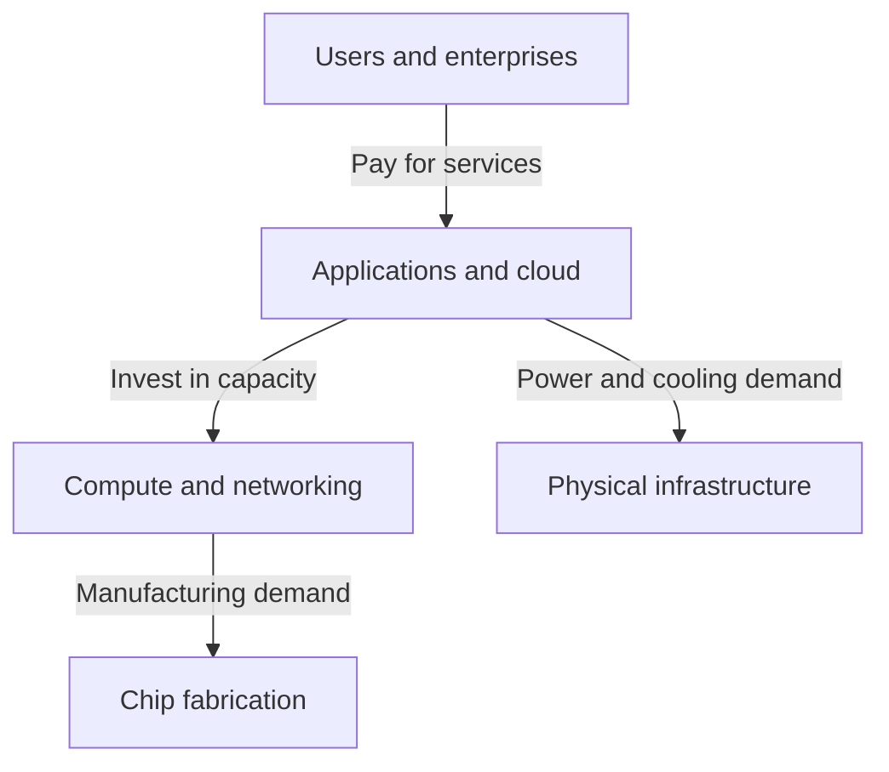

# Follow the AI spending

**Where does AI spending become durable cash flow—and how much depends on the same spending cycle?**

This research universe follows nine companies from chip manufacturing to applications.
Microsoft is the first reviewed case. The others have verified profiles and collected
disclosures, with investment conclusions still to establish. These are research
subjects, not holdings.

The arrows describe conceptual economic relationships, not verified contracts
between the companies below. Layers overlap: application companies can build their
own infrastructure, and cloud companies can design chips.

| Layer and company sources | What we still need to understand |
|---|---|
| Chips and fabrication: [NVIDIA](https://www.nvidia.com/en-us/data-center/), [TSMC](https://www.tsmc.com/english/aboutTSMC) | Can orders become sustained cash generation after manufacturing expansion, inventory, and customer payment timing? |
| Networking: [Broadcom](https://investors.broadcom.com/news-releases/news-release-details/broadcom-inc-announces-third-quarter-fiscal-year-2026-financial) | How dependent are custom accelerators and networks on a few customers' capacity plans? |
| Power and cooling: [Constellation](https://www.constellationenergy.com/about/business-overview.html), [Vertiv](https://www.vertiv.com/en-us/about/about-us/) | When do contracts and deployment plans become operating cash, after construction and capacity costs? |
| Cloud: [Microsoft](https://azure.microsoft.com/en-us/solutions/ai), [Amazon](https://aws.amazon.com/ai/), [Alphabet](https://cloud.google.com/ai) | Does customer usage generate enough cash to support equipment spending and other infrastructure commitments? |
| Applications: [Meta](https://about.fb.com/news/2026/01/2026-ai-drives-performance/) | Can better recommendations, advertising, and products support the infrastructure they require? |

## Read the evidence carefully

One company's investment can support another company's sales. Owning several layers
would therefore not necessarily remove exposure to a slowdown in the same underlying
spending cycle. That is a hypothesis to investigate, not a measured correlation.

The selected disclosures span July–September 2026; Alphabet also has a separately
dated February transcript covering 2025. They mix quarterly, half-year, annual, and
trailing-twelve-month figures. Fiscal year labels and currencies differ. TSMC reports
under TIFRS; reported free-cash-flow deductions also vary across companies. The
[source-linked universe](../public/universe.json) is a starting map, not a comparable
financial dataset.

The selected TSMC and Constellation releases lack operating-cash-flow/capex tables;
Alphabet's current CEO remarks lack a current cash reconciliation. Missing evidence
stays missing. Backlog, forecasts, and signed future contracts are not cash receipts.

Start with [Microsoft's checked case](CURRENT-CASE.md): cash generation grew while
cash investment grew faster. The next useful result is an explanation of these
dependencies supported by complete, consistently scoped evidence, including what
would change the interpretation at each layer.
