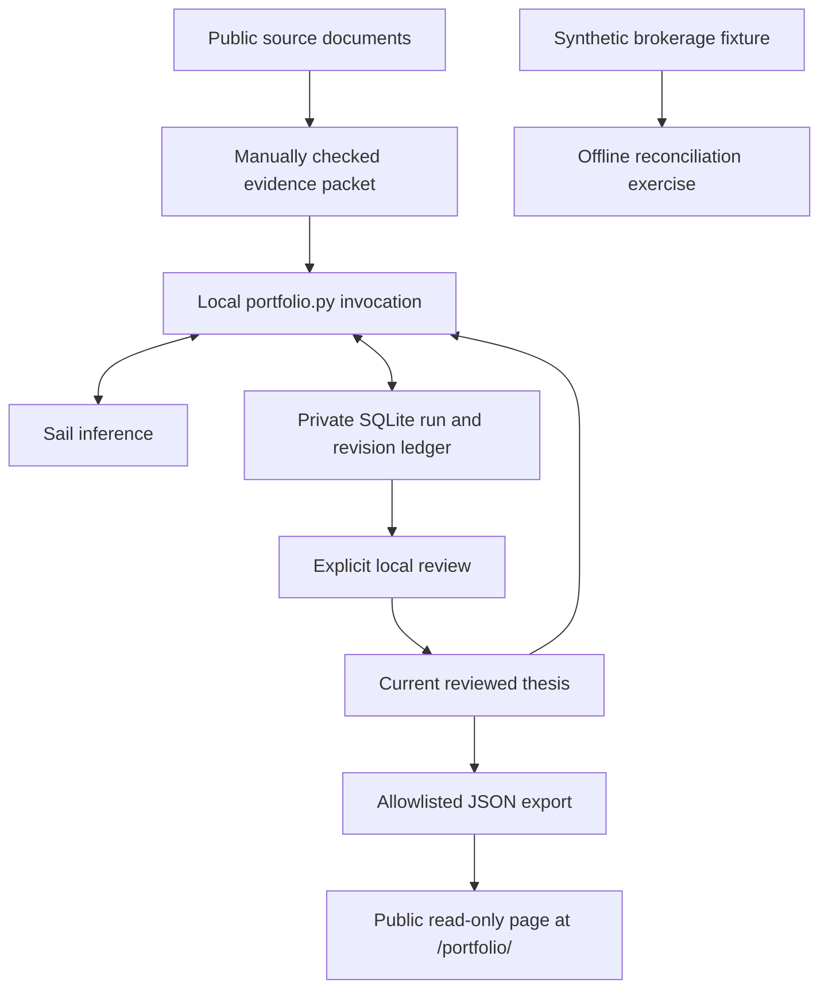

# Architecture

## Working V1

The current system is a local research workflow with durable memory and a public static ledger. It has no brokerage connection, trade capability, scheduler, or automatic evidence retrieval.

### Evidence and memory

`data/thesis/` holds checked public source facts, context, dates, and stable citation IDs. The request includes this packet plus the previous reviewed thesis and its original packet. V1 asks for qualitative interpretations; numeric facts on the public page come from the packet.

The model returns a private draft. Local checks enforce its schema and citation IDs, but cannot establish that a source supports a claim. Explicit review checks that substance and advances the current thesis. Immutable revisions retain their original evidence and hash. Competing drafts cannot overwrite a newer reviewed parent.

`watch`, `hold`, and `review` describe research views, not account positions or trade instructions. The next-review field is a proposed trigger, not a scheduled task.

### Requests and cost

The model, completion window, and reasoning allowance are explicit in each saved request. `portfolio.py preview` displays the current configuration and limits without making an API call. Each logical run reserves $0.20 against a separate $2 local allowance before submission. The ledger keeps unsuccessful and uncertain runs too.

The request body and idempotency key survive process restarts. Once a response ID is known, resume retrieves it. Uncertain resubmission is refused after 23 hours or if the credential has changed. Terminal incomplete or invalid output does not trigger an automatic paid redraft. A client timeout does not cancel accepted provider work.

Cost estimates use the run's dated rates and reported usage. Unfinished work and malformed or missing usage remain unknown; failed or incomplete terminal work with valid usage still contributes to cost. Provider-billed expense is a separate, not-yet-reconciled measurement. Local allowances do not cap spending in other applications or survive deletion of their database history.

### Public boundary

The personal-site Worker serves `portfolio/snapshot.json` at the read-only research page. Export constructs named fields from reviewed history; it excludes private predictions, prompts, raw provider responses, errors, and account identifiers. Exporting does not deploy the site. The artifact and its diff are reviewed before publication.

A visitor reads precomputed data and cannot launch inference, inspect private state, or place an order. The public page carries no Sail or brokerage credentials. Source dates remain visible so old evidence is not mistaken for a new observation.

### Private storage and the brokerage exercise

`.data/portfolio.sqlite` contains research runs, immutable revisions, review records, and the current head. `.env` contains the Sail credential; both paths are ignored by Git. A nonsecret credential fingerprint binds uncertain retries to the original API-key scope.

`brokerage.py` reads an explicitly synthetic fixture and prints its reconciliation without network access or saved output. Its normalized internal contract is not Schwab's schema. Requested quantities belong to orders; only executed fills move holdings and cash. External deposits and withdrawals are excluded from P&L. Book cash does not mean settled cash or buying power.

`lab.py` remains the earlier extraction and accounting experiment, with its own private ledger and dated result. It is separate from the thesis workflow.

## Future boundaries

A private Schwab adapter will first expose account observations and reconciliation, using the owner's approved API capabilities. Authentication, renewal behavior, settlement, corporate actions, and data-display permissions still need confirmation and implementation.

Later, a durable research queue may use Sailboxes for isolated execution and Voyages for traces. Sail supplies inference, runtime, and telemetry; our code owns memory, orchestration, evaluation, and policy. Persistent work requires durable records even if a VM wakes without its prior processes.

Any future order service must be separate from research. It will accept structured proposals only after strong owner authentication and deterministic checks of authority, instrument, quantity, current cash and positions, freshness, exposure, and open orders. External documents cannot grant permissions. Never assume Sail's idempotency guarantees apply to Schwab.

Public performance will require reconciled data, appropriate display rights, external-cashflow handling, and explicit separation of simulated and live outcomes. Project expenses remain visible separately from brokerage P&L. See the [roadmap](ROADMAP.md) for the staged plan.
