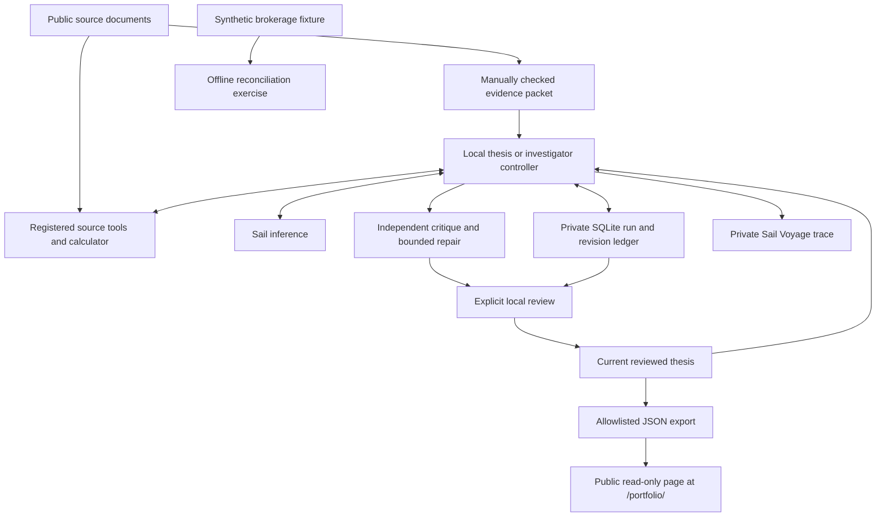

# Architecture

## Working V1

The current system is a local research workflow with durable evidence, reviewed memory, and a public static ledger. A model-driven investigator can retrieve registered primary sources and calculate with checked facts. It has no trade capability or scheduler. An optional private account connector is separate from research and publication.

### Evidence and memory

`data/thesis/` holds checked public source facts, context, dates, and stable citation IDs. The request includes this packet plus the previous reviewed thesis and its original packet. The investigator also freezes up to three reviewed investigations as starting memory. It must recheck earlier conclusions against evidence; prior memory is not a new disclosure. V1 asks for qualitative interpretations; numeric facts on the public page come from the packet.

`research_sources.py` allows two fixed issuer documents. Captures preserve publication and retrieval dates, hashes, and normalized text. Tool results contain exact slices with hash-and-offset citation IDs. Retrieval ranks query coverage and term rarity; calculations accept only compatible fact IDs, units, and periods. Source text is data and cannot expand tool permissions. When context grows, a deterministic notebook preserves all observed passages, calculations, and hypotheses while removing duplicated transcript content. Full provider responses remain in the private ledger.

The model returns a private draft. Local checks enforce its schema and citation IDs, but cannot establish that a source supports a claim. An independent critic sees the evidence and prior memory; it can request one automatic repair. An explicit editorial amendment preserves the original and requires a new critique. Explicit review checks substance and permits publication. Thesis reviews advance the thesis head; investigation reviews freeze separate reports for public export and future memory. Competing thesis drafts cannot overwrite a newer reviewed parent.

`watch`, `hold`, and `review` describe research views, not account positions or trade instructions. The next-review field is a proposed trigger, not a scheduled task.

### Requests and cost

The model, completion window, and reasoning allowance are explicit in each saved request. `portfolio.py preview` displays the thesis configuration without an API call. Every model step reserves its profile's conservative allowance before submission. Thesis, investigator, critic, and evaluation calls share one durable configurable limit; `portfolio.py budget` reports it. The ledger keeps unsuccessful and uncertain runs too. Stable workflow task keys prevent a repeated step from becoming a second reservation.

The request body and idempotency key survive process restarts. Once a response ID is known, resume retrieves it. Uncertain resubmission is refused after 23 hours or if the credential has changed. Terminal incomplete or invalid output does not trigger an automatic paid redraft. A client timeout does not cancel accepted provider work.

Cost estimates use the run's dated rates and reported usage. Unfinished work and malformed or missing usage remain unknown; failed or incomplete terminal work with valid usage still contributes to cost. Provider-billed expense is a separate, not-yet-reconciled measurement. Local allowances do not cap spending in other applications or survive deletion of their database history.

### Public boundary

The personal-site Worker serves the thesis snapshot, reviewed investigations, and compact evaluation summaries at the read-only research page. Exports construct named fields; they exclude private predictions, prompts, raw provider responses, full source captures, errors, and account identifiers. The critic's explanatory prose is not published as verified evidence; its displayed status is derived from the verdict and issue count. Exporting does not deploy the site. Artifacts and their diffs are reviewed before publication.

A visitor reads precomputed data and cannot launch inference, inspect private state, or place an order. The public page carries no Sail or brokerage credentials. Source dates remain visible so old evidence is not mistaken for a new observation.

### Private storage and the brokerage exercise

`.data/portfolio.sqlite` contains research runs, immutable revisions, review records, and the current head. `.env` contains the Sail credential; both paths are ignored by Git. A nonsecret credential fingerprint binds uncertain retries to the original API-key scope.

`brokerage.py` reads an explicitly synthetic fixture and prints its reconciliation without network access or saved output. Its normalized internal contract is not Schwab's schema. Requested quantities belong to orders; only executed fills move holdings and cash. External deposits and withdrawals are excluded from P&L. Book cash does not mean settled cash or buying power.

`lab.py` remains the earlier extraction and accounting experiment, with its own private ledger and dated result. It is separate from the thesis workflow.

## Future boundaries

A private Schwab adapter supports owner authorization and account reads; it is separate from the research runtime. Live account verification and richer reconciliation remain necessary before account observations inform decisions. Settlement, corporate actions, and public display permissions require their own work.

A later durable assignment queue can use Sailboxes for execution. The current measured Sailbox proof runs isolated offline tests and restores synthetic accepted-request state through sleep/pause/resume. Live Voyages already trace research and evaluation steps. Sail supplies inference, runtime, and telemetry; our code owns memory, orchestration, evaluation, and policy. Persistent work requires durable records even if a VM wakes without its prior processes.

Any future order service must be separate from research. It will accept structured proposals only after strong owner authentication and deterministic checks of authority, instrument, quantity, current cash and positions, freshness, exposure, and open orders. External documents cannot grant permissions. Never assume Sail's idempotency guarantees apply to Schwab.

Public performance will require reconciled data, appropriate display rights, external-cashflow handling, and explicit separation of simulated and live outcomes. Project expenses remain visible separately from brokerage P&L. See the [roadmap](ROADMAP.md) for the staged plan.
