# Planned architecture

Only the extraction experiment exists today. This document defines the boundaries for future implementation.

```mermaid
flowchart TD
    Owner[Owner with strong authentication] --> Control[Private assignments and approvals]
    Control --> Research[Research controller]
    Sources[Public documents] --> Research
    Research <--> Store[Private durable research and task store]
    Research --> Sail[Sail inference and later Sailboxes]
    Research --> Traces[Private execution traces]
    Research --> Proposal[Structured trade proposal]
    Control --> Policy[Deterministic authorization and limits]
    Proposal --> Policy
    Policy --> Broker[Private Schwab connector]
    Broker <--> Schwab[Owner-selected brokerage account]
    Broker --> Ledger[Reconciled portfolio and order ledger]
    Store --> Export[Allowlisted public export]
    Ledger --> Export
    Export --> Site[Read-only public dashboard]
```

## Public and private access

The website serves approved exports. It does not hold brokerage credentials, accept order instructions, expose private traces, or proxy arbitrary agent tasks. Publication is an explicit allowlist of fields; raw account identifiers, transactions, tokens, and prompts are private by default. Read-only access does not itself grant market-data redistribution rights.

Owner controls use strong authentication such as a passkey, server-side authorization, session protection, and an audit trail. A short shared code is not the brokerage security boundary. Start with a single owner; additional principals and delegated trading permissions are outside the initial scope.

## Research is separate from authority

The research worker can read authorized observations, cite evidence, run bounded calculations, and produce proposals. External documents are untrusted data. Their contents cannot change permissions or be interpreted as commands to the execution service.

The execution service accepts only a structured proposal and a valid owner approval or a later explicitly authorized mandate. It independently checks instrument, quantity, order type, price constraints, current cash/positions, freshness, and exposure including open orders. Model-generated explanations do not bypass these checks.

## Durable records

Keep versioned source documents and hashes, extracted facts, thesis revisions, research tasks, model/prompt versions, cost reservations, proposals, approvals, order attempts, fills, reconciliations, and publication snapshots. Use UTC timestamps and explicit currencies/units. An observation is not an assumption; a proposal is not an order; an accepted order is not a fill.

Save state before external actions. Where a provider offers idempotency, obey its scope and retention. Never assume Sail's retry guarantees also apply to Schwab. An ambiguous brokerage submission requires reconciliation before another placement. Unknown account state blocks execution.

## Persistent work and costs

Each investigation has a terminal outcome, a research budget, and checkpoints. Track submitted-but-unresolved work as outstanding spend. Keep a durable source of truth outside ephemeral compute and test cold-start recovery. Assignments can be linked across months without keeping a single process or context window alive indefinitely.

Sail supplies inference and later sandbox execution and tracing. We own orchestration, memory, evaluation, and policy. Account authentication can require owner intervention; expired authorization should pause dependent work and surface its state.

Report model usage estimates separately from metered charges, and brokerage P&L separately from project costs. Public performance must account for deposits and withdrawals and clearly label simulations. No claim of a profitable strategy is implied.

## Current implementation

`lab.py` is the initial extraction and cost-measurement component. It does not implement the boxes in this diagram. Its private `.data/runs.sqlite` and dated reports preserve the first experiment. Retain it while building the new modules incrementally; no placeholder broker endpoints or pretend portfolio results are needed.
