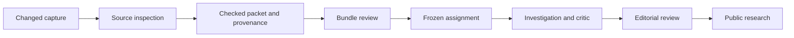

# Carry a reviewed source update into research

`source_curation.py` connects the source inbox to an explicit research assignment.
It freezes a manually checked packet, exact source captures, and item-level
provenance in a private bundle. A separate factual review approves that bundle;
the queue can then copy it into an immutable assignment.



These are distinct decisions. Accepting a source candidate does not approve a
financial fact. Approving a bundle does not buy inference or approve the agent's
future conclusion. Enqueue also makes no model call; advancing the queue can.

## What the bundle binds

Every retained fact and commentary item needs provenance against its selected
source capture, even if its wording or value did not change. Replacing a source
while silently keeping old unchecked facts would defeat the handoff.

Source numbers bind exact text spans. Unit and fiscal-period mappings bind their
header spans and the corresponding packet fields. Sign normalization is explicit;
derived facts use a small set of checked arithmetic operations over named facts.
Commentary binds exact supporting passages. Arithmetic and hash checks are
deterministic. The reviewer still decides whether the chosen column, accounting
definition, unit mapping, and interpretation are appropriate.

The bundle preserves the prior packet, the new packet, selected source-watch
version IDs, full source snapshots, provenance, preparation time, and the later
approval or rejection. An approval binds the exact bundle hash. Previous bundles,
source reviews, baseline captures, and research records are not rewritten.

The current contract covers the two registered Microsoft sources and one thesis.
A bundle must select every registered source and include at least one accepted
substantive change. It cannot register arbitrary URLs or switch company identity.
New filings and companies still require deliberate source registration.
Expanding that registry also needs a versioned migration for existing curated
jobs; silently changing the registry would invalidate their current contract.

## Dates and freshness

An issuer's publication date, a capture's retrieval time, and the time this
project first observed its contents mean different things. A corrected July page
first observed in September is not evidence that the correction existed in July.
The new packet's evidence date must accommodate the selected observations.
A download that finishes after midnight belongs to the completion day for this
cutoff, even if it started the day before. The bundle preserves that observation's
identity and completion time separately from its retrieval timestamp.

Before preparing, approving, or first enqueuing a bundle, the handoff compares its
selected content with the latest successful source observations. A newer
substantive change or a reversion makes it stale. A changed request-trace line
alone does not. Pending, rejected, or metadata-only captures cannot stand in for
an accepted substantive update.

The queue checks freshness and saves the assignment in one database transaction.
After that, the assignment owns its frozen inputs. Repeating the identical job
key or resuming an interrupted request does not reread the current source cache
or replace its evidence with a later bundle. Reviewed research memory still
freezes when the investigation is first created and remains a dated prior view.

## Inspect and curate locally

These commands read an existing research ledger without creating or changing it:

```sh
python3 scripts/curate_sources.py sources
python3 scripts/curate_sources.py status
python3 scripts/curate_sources.py inspect BUNDLE_ID
```

`sources` supplies the private watch-version identities, including unchanged
baselines. `inspect` shows the exact checked packet, provenance, hashes, and source
dates. A saved approval is displayed separately from whether later observations
have made that bundle stale. None of these commands checks a brokerage account
or calls a model.

After inspecting and accepting a substantive source candidate, prepare a private
JSON input file with exactly four fields:

- `prior_packet`: the prior complete checked packet.
- `packet`: the proposed complete packet, with its updated evidence date.
- `source_versions`: one watch-version UUID for every registered source.
- `provenance`: explicit entries for every proposed fact and commentary item.

The [synthetic fixture](../../../experiments/tests/test_source_curation.py) demonstrates the complete
provenance shape. Its helper understands only its own invented fixture text; it
is not a parser or curator for real financial statements. Real mappings need
their column, scale, sign, and interpretation checked against the source.

```sh
python3 scripts/curate_sources.py prepare source-update --input .data/curation-input.json
python3 scripts/curate_sources.py inspect BUNDLE_ID
python3 scripts/curate_sources.py review BUNDLE_ID approve --sha256 BUNDLE_HASH --reviewer 'Local Editor'
```

Preparation returns `BUNDLE_ID` and `BUNDLE_HASH`; substitute those exact values
after inspection. Use `reject` for a final rejection. A changed input needs a new
key and review; neither command overwrites a prior decision. The input file and
bundle records remain private. These commands save local review records, with
zero inference or publication. The queue's `--bundle BUNDLE_ID` option is the
separate assignment handoff, subject to the existing limits below.

Run the isolated integration proof without credentials:

```sh
python3 -m unittest discover -s tests -p 'test_curation*.py' -v
python3 -m unittest discover -s tests -p test_source_curation.py -v
```

## Current boundary

The [validation record](../../../experiments/data/experiments/source-curation-validation-2026-09-13.json)
records 38 new offline tests and a passing 299-test Python suite. The integration
proof uses synthetic captures and mocked inference. The live source watch
has not yet supplied a substantive financial update for factual curation. A test
fixture is not a newly observed Microsoft disclosure.

The pilot queue's existing two durable job slots remain consumed. This addition
does not create more slots, raise a budget, reset request history, or schedule a
paid follow-up. A future bounded queue protocol can use reviewed bundles while
preserving those records.

Public exports remain behind the existing investigation review. Bundle source
text, review identities, and private operational state are not added to the
website. See the [source inbox](SOURCE-WATCH.md),
[queue contract](RESEARCH-QUEUE.md), and [research loop](RESEARCH-LOOP.md).
